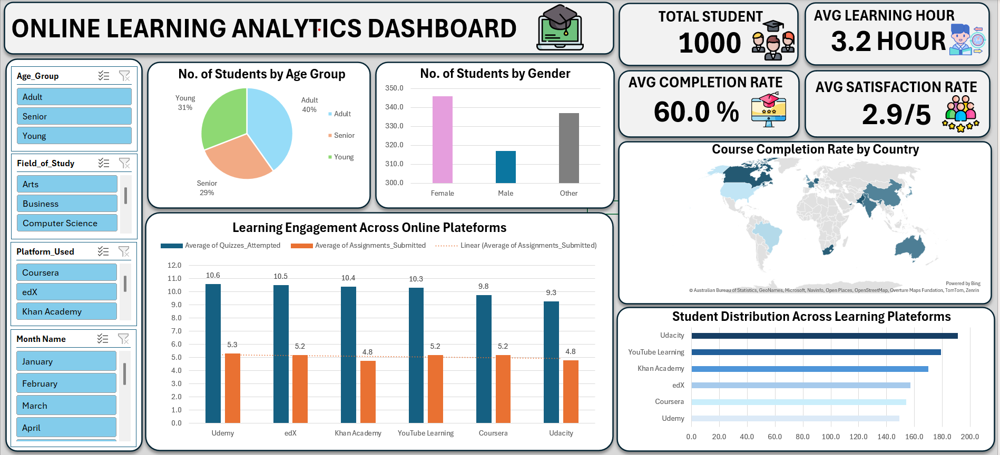
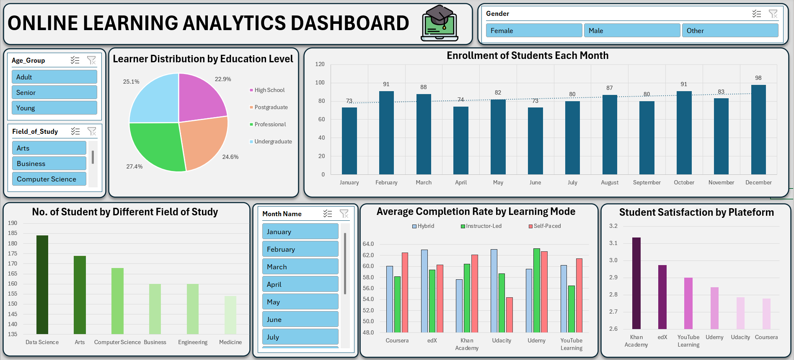

# 🎓 Online Learning Behavior Analytics Dashboard

## 📌 Project Overview
This project analyzes **online learning behavior and engagement patterns** using Microsoft Excel.  
The dashboard provides insights into **student demographics, learning engagement, course completion rates, and platform performance**.

The analysis helps understand how students interact with online learning platforms and identifies trends that influence **learning outcomes and satisfaction**.

---

# 📊 Dashboard 1: Global Learning Insights

### Key Metrics
- **Total Students:** 1000
- **Average Learning Hours:** 3.2 hours
- **Average Completion Rate:** 60%
- **Average Student Satisfaction:** 2.9 / 5

### Key Insights

**1️⃣ Student Distribution by Age**
- Adults represent the largest group (40%)
- Young learners account for 31%
- Seniors represent 29%

📌 Insight:  
Online learning platforms are most popular among **adult learners**.

---

**2️⃣ Learning Engagement by Platform**
- Udemy and edX show the highest quiz participation.
- Assignments submitted remain relatively consistent across platforms.

📌 Insight:  
Interactive learning features increase student engagement.

---

**3️⃣ Platform Popularity**
Most students use:
- Udacity
- YouTube Learning
- Khan Academy

📌 Insight:  
Students prefer platforms that offer **structured learning and free resources**.

---

**4️⃣ Global Course Completion**
Completion rates vary across countries, indicating differences in:
- Learning accessibility
- Internet availability
- Educational adoption

---

# 📊 Dashboard 2: Learning Behavior Analysis

### Key Insights

**1️⃣ Enrollment Trends**
Student enrollment fluctuates throughout the year.

Highest enrollments:
- February
- October
- December

📌 Insight:  
Students tend to enroll more during **career transition periods and new learning cycles**.

---

**2️⃣ Education Level Distribution**
Learners are distributed across:
- High School
- Undergraduate
- Professional
- Postgraduate

📌 Insight:  
Online learning attracts learners from **multiple education levels**.

---

**3️⃣ Field of Study**
Most popular learning fields include:
- Data Science
- Arts
- Computer Science
- Business

📌 Insight:  
Technical and skill-based courses dominate online education.

---

**4️⃣ Completion Rate by Learning Mode**
Learning modes analyzed:
- Self-Paced
- Instructor-Led
- Hybrid

📌 Insight:  
Hybrid and instructor-led models generally show **higher completion rates**.

---

**5️⃣ Student Satisfaction by Platform**
Highest satisfaction observed on:
- Khan Academy
- edX
- YouTube Learning

📌 Insight:  
Platforms offering **quality content and accessibility** receive better feedback.

---

# 🛠 Tools & Techniques Used
- Pivot Tables
- Pivot Charts
- Data Cleaning
- Dashboard Design
- Slicers for Interactivity
- Data Visualization

---

# 🎯 Value
This dashboard helps:
- Understand online learning engagement
- Identify popular platforms
- Track course completion trends
- Analyze student satisfaction
- Support decision making for e-learning providers

---

# 📁 Dataset
The dataset contains global online learning behavior data including:
- Student demographics
- Platform usage
- Course completion rates
- Learning hours
- Satisfaction scores

---

# 🚀 Conclusion
Online learning platforms are increasingly popular across different demographics.  
Engagement, completion rate, and satisfaction vary based on **platform, learning mode, and field of study**.

These insights can help **educational institutions and e-learning companies improve course design and student engagement**.
